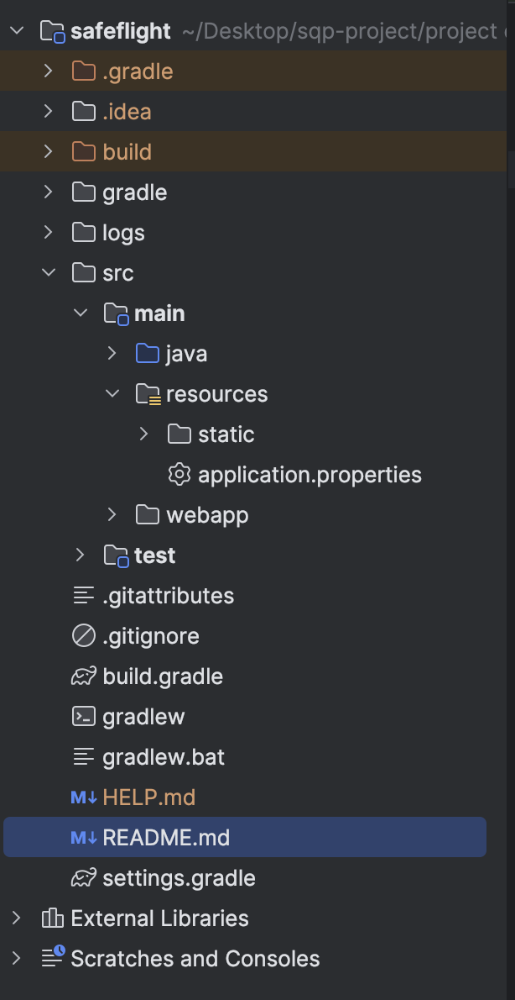
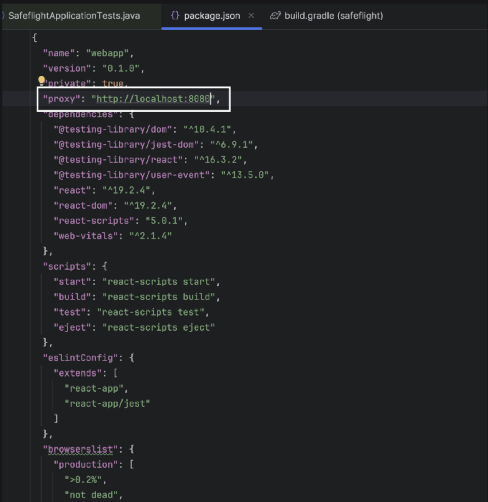

# SafeFlight Project

## Steps to Set Up the Project

### 1. Clone the Repository

```bash
git clone https://github.com/harrishdhaithya/group4-safeflight-project.git
cd group4-safeflight-project
```

### 2. Install Node.js

Install the latest version of Node.js if it is not already available on your machine:

👉 [https://nodejs.org/en/download/](https://nodejs.org/en/download/)

---

## Project Structure




---

## Important Files and Folders

* **`src/main/java`**
  Contains all backend Java source files.

* **`src/main/webapp`**
  Contains all frontend (React) code.

* **`src/main/resources/application.properties`**
  Contains logging and application configuration.

* **`src/main/resources/static`**
  React build files are copied here after building the frontend.

* **`build.gradle`**
  Contains all Gradle build configurations.

* **`.gitignore`**
  Lists files and folders that should not be tracked by Git.

---

## Build the Project

Open a terminal or command prompt in the project root directory.

### Build (incremental build)

```bash
./gradlew build
```

### Clean build artifacts

```bash
./gradlew clean
```

### Full build (recommended)

```bash
./gradlew clean build
```

---

## Run the Application

After building the project, run the generated JAR file:

```bash
java -jar build/libs/safeflight-0.0.1-SNAPSHOT.jar
```

---

## Frontend Development (React)

> ⚠️ Changes made to React files will **not appear** until the project is rebuilt.

To see frontend changes immediately, run the React app separately.

### Steps:

1. Open a terminal inside:

```bash
src/main/webapp
```

2. Install dependencies (first time only):

```bash
npm install
```

3. Start the React development server:

```bash
npm start
```

The React app will run on its own development server.

---

## API Proxy Configuration

* A proxy is configured in `package.json` to redirect API calls to the backend.
* If your backend runs on a different port, update the proxy URL accordingly.



